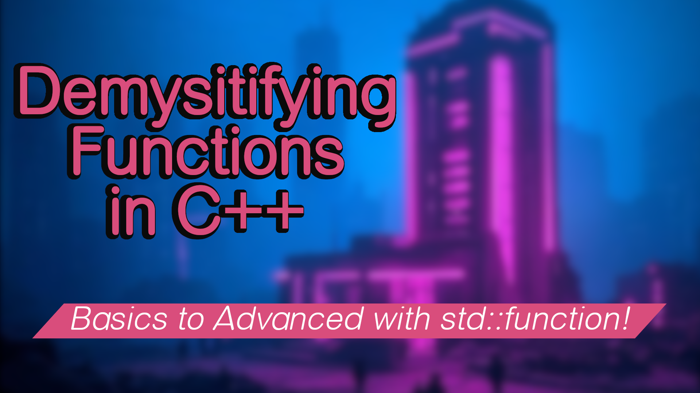

# Demystifying C++ Functions (What is std::function?)
- build a simple application using functions
- understand functions and std::function
- make structs for large parameter lists

## Build Instructions
to build the code from this directory:
`cmake --preset default && cmake --build build`